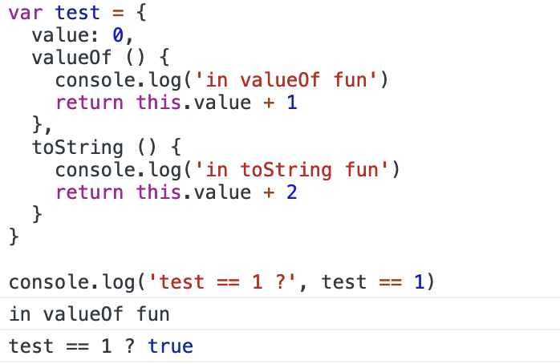
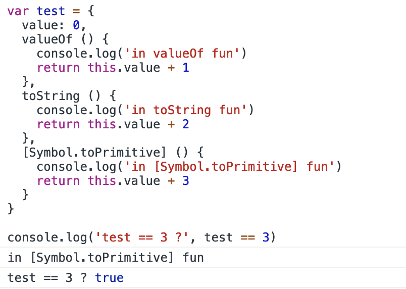

# 从 == 和 === 入手，聊聊隐式类型转换

> 面试官：== 和 === 有什么区别？  
> 童鞋：=== 要求数据类型相同，== 会进行隐式类型转换...
> 面试官：JavaScript:(a==1 && a==2 && a==3)能输出true么？  
> 童鞋：???  

下面，我们来一起看看 == 和 === 到底有什么区别，以及上面问题的解法。


## 数据类型

JavaScript 语言中，数据类型有：undefined、null、Boolean、String、Number、Object、Symbol。

其中，Object被称为引用数据类型，其他6种被称为基本数据类型。Symbol 是一种类似于字符串的，表示独一无二值的数据类型。


## 隐式类型转换

做一个小实验，得出不同类型的值用 == 操作符比较后的结果

| 类型(x) | 类型(y) | 结果 | 
| --- | --- | --- |
| undefined | null | true |
| String | Number | toNumber(x) == y |
| Boolean | 任何数据类型 | toNumber(x) == y |
| Object | 任何数据类型 | toPrimitive(x) == y |
| Symbol | 任何数据类型 | false |


toNumber() 和 toPrimitive() 方法是内部的，可以看一下估值

toNumber() 方法，比较好理解，就是转换成 Number 类型，类似 Number() 方法。

| 类型 | 结果 | 
| --- | --- |
| undefined | NAN |
| null | 0 |
| Boolean | 任何数据类型 |
| String | Number |

toPrimitive() 方法
 
| 类型 | 结果 | 
| --- | --- |
| Object | 如果对象的 `valueOf` 方法的结果是原始值，返回原始值; 如果对象的 `toString` 方法返回原始值，就返回这个值; 也可以重写 `Symbol.toPrimitive`，该方法在转基本类型时调用优先级最高; 其他情况都返回一个错误 |

举两个例子，来说明一下 toPrimitive() 方法：

```js
var test = {
  value: 0,
  valueOf () {
    console.log('in valueOf fun')
    return this.value + 1
  },
  toString () {
    console.log('in toString fun')
    return this.value + 2
  }
}

console.log('test == 1 ?', test == 1)
```
控制台输出结果：



通过输出可以看出，`valueOf` 的优先级要高于 `toString`，下面再来看一下 `Symbol.toPrimitive` 的优先级。

```js
var test = {
  value: 0,
  valueOf () {
    console.log('in valueOf fun')
    return this.value + 1
  },
  toString () {
    console.log('in toString fun')
    return this.value + 2
  },
  [Symbol.toPrimitive] () {
    console.log('in [Symbol.toPrimitive] fun')
    return this.value + 3
  }
}

console.log('test == 3 ?', test == 3)
```
控制台输出结果：



通过输出可以看出，这三个方法的优先级从高到低依次为：`Symbol.toPrimitive` > `valueOf` > `toString`。

## 回到面试题

> JavaScript:(a==1 && a==2 && a==3)能输出true么？

```js
let a = {
  value: 0,
  valueOf () {
    return ++this.value
  }
}
```

面试遇到隐式类型转换，再也不会怕啦～

欢迎各位关注我的Blog，正文以issue形式呈现，喜欢请点star，订阅请点watch～
