# 微信小程序集成 Jenkins

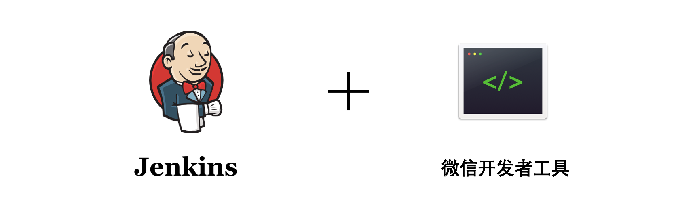

## 背景

微信小程序的测试发布在没有 CI/CD 等相关工具的情况下，存在着如下的问题：

- 小程序开发助手中，同一个开发者只能显示一个开发版本
- 测试同事找开发要二维码，效率较低
- 本地生成的二维码会出现携带本地代码、未及时拉取分支其他改动等问题

为了避免如上问题的发生，采用**微信小程序集成 Jenkins** 的方案。

## 基础

在介绍实现方案之前，先来回顾一下常规的微信小程序发布流程。

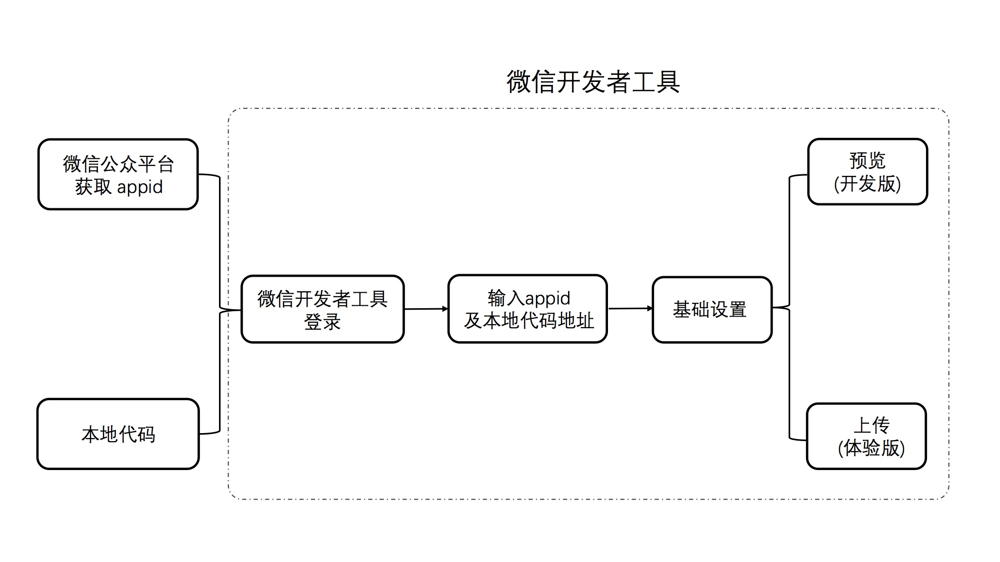

从上面的流程图可以看出，微信小程序预览、上传都是需要在微信开发者工具中进行的，接下来了解一下微信开发者工具提供的上传方式。

### 微信开发者工具

除了图形化界面，微信开发者工具还提供了命令行与 HTTP 服务两种接口供外部调用，来进行登录、预览、上传等操作。

#### 命令行调用

命令行工具所在位置：

macOS: <安装路径>/Contents/Resources/app.nw/bin/cli  
Windows: <安装路径>/cli.bat  

以 macOS 操作系统示例：

1、打开开发者工具：

```
/Applications/wechatwebdevtools.app/Contents/Resources/app.nw/bin/cli -o
```

其中，`/Applications/wechatwebdevtools.app/`为安装路径。

2、登录：

```
/Applications/wechatwebdevtools.app/Contents/Resources/app.nw/bin/cli -l
```

输入上面的命令行后，终端中打印出登录二维码，使用微信扫码登录。在微信端完成操作之后，会输出 `login success`，如下图所示：


如果想得到 base64 形式的二维码，可以使用下面的命令：

```
# 登录，在终端中打印登录 base64 形式的二维码
cli -l --login-qr-output base64

# 登录，二维码转成 base64 并存到文件 /Users/username/code.txt 
cli -l --login-qr-output base64@/Users/username/code.txt
```

更多 API 可以参考 [命令行调用](https://developers.weixin.qq.com/miniprogram/dev/devtools/cli.html) 。

#### HTTP 服务

HTTP 服务在**工具启动后自动开启**，每次开启 host 固定为 127.0.0.1，端口号并不固定。端口号在**用户目录**下记录，位置如下：

macOS : ~/Library/Application Support/微信web开发者工具/Default/.ide  
Windows : ~/AppData/Local/微信web开发者工具/User Data/Default/.ide

以 macOS 操作系统示例：

首先需要**运行开发者工具**，可以利用上面介绍的命令行方法打开微信开发者工具。

```
/Applications/wechatwebdevtools.app/Contents/Resources/app.nw/bin/cli -o
port=$(cat "/Users/zyy/Library/Application Support/微信web开发者工具/Default/.ide")
echo "微信开发者工具运行在${port}端口"
```

这样就可以拿到微信开发者工具运行的端口号了，其中，`/Users/zyy/` 为用户目录。

1、打开开发者工具：

```
# 打开工具
http://127.0.0.1:端口号/open
# 打开/刷新项目
http://127.0.0.1:端口号/open?projectpath=项目全路径
```

2、登录：

```
# 登录，返回图片格式的二维码
http://127.0.0.1:端口号/login
# 登录，取 base64 格式二维码
http://127.0.0.1:端口号/login?format=base64
# 登录，取 base64 格式二维码，并写入 /Users/username/logincode.txt
http://127.0.0.1:端口号/login?format=base64&qroutput=%2FUsers%2Fusername%2Flogincode.txt
```

3、预览：

```
# 预览路径为 /Users/username/demo 的项目，返回图片格式的二维码
http://127.0.0.1:端口号/preview?projectpath=%2FUsers%2Fusername%2Fdemo

# 预览路径为 /Users/username/demo 的项目，返回 base64 格式的二维码
http://127.0.0.1:端口号/preview?projectpath=%2FUsers%2Fusername%2Fdemo&format=base64

# 预览路径为 /Users/username/demo 的项目，返回 base64 格式的二维码，并写入 /Users/username/logincode.txt
http://127.0.0.1:端口号/preview?projectpath=%2FUsers%2Fusername%2Fdemo&format=base64&qroutput=%2FUsers%2Fusername%2Flogincode.txt

# 预览路径为 /Users/username/demo 的项目，返回图片格式的二维码，并将预览信息输出至 /Users/username/info.json
http://127.0.0.1:端口号/preview?projectpath=%2FUsers%2Fusername%2Fdemo&infooutput=%2Users%2username%2info.json
```

更多 API 可以参考 [HTTP 调用](https://developers.weixin.qq.com/miniprogram/dev/devtools/http.html) 。

## 方案

微信开发者工具目前只有 macOS 和 Windows 两种版本，这限制了服务器的系统。下面以 macOS 为例，
来介绍具体的实现过程：

### 安装 Jenkins

> The leading open source automation server, Jenkins provides hundreds of plugins to support building, deploying and automating any project.  
> 作为领先的开源自动化服务器，Jenkins提供数百个插件来支持构建，部署和自动化任何项目。

Jenkins 依赖于 Java 运行环境，所以需要在机器上安装 Java。安装 Jenkins 方式很多，可以在[官网](https://jenkins.io/download/)直接下载最新的软件包，然后执行下面的命令启动 Jenkins 。

```
java -jar jenkins.war --httpPort=8888
```

其中，`--httpPort=8888` 为设置服务端口号，默认端口号为 8080 。

### 新建任务

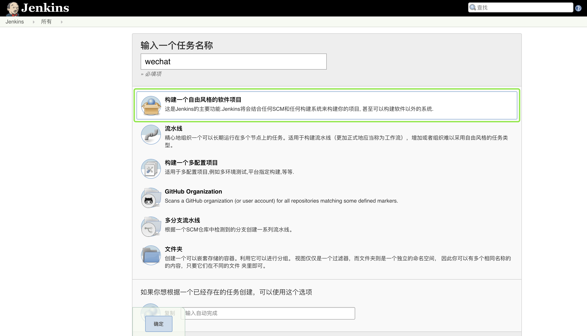

选择 “**构建一个自由风格的软件项目**” ，在输入任务名称之后，点击确定按钮，进入到任务配置页面。

### 任务配置

在介绍任务配置之前，先来看一下最终要实现的功能。

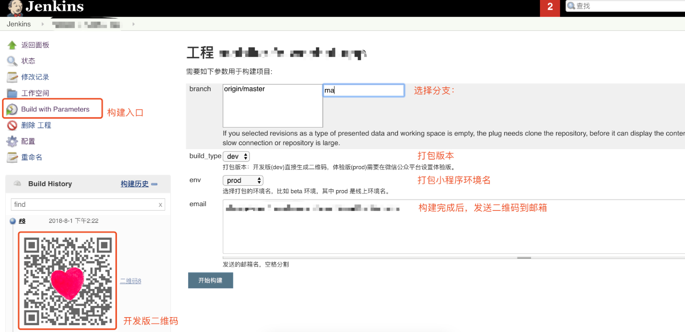

主要的功能点如下：

- 使用 git 来管理代码，可以选择分支
- 打包版本（开发版／体验版）可以选择（注意：这里的「开发版」对应「预览」，体验版对应「上传」）

#### 1、源码管理

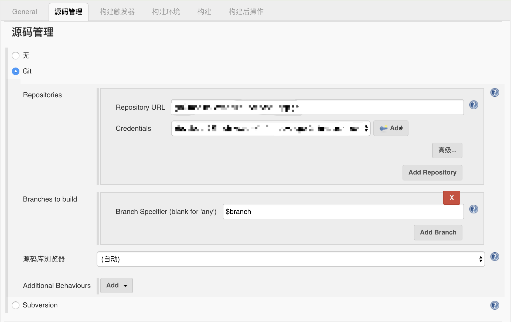

在任务配置页面的第二项 “源码管理” 中，选择 git 方式管理代码。填入 git 仓库地址及访问的账户，上图中的 `$branch` 是自定义的构建参数，下面来看一下构建参数的定义。

#### 2、构建参数

在任务配置页面的第二项 “General” 中，选择 “参数化构建过程”，进入构建参数配置页面。

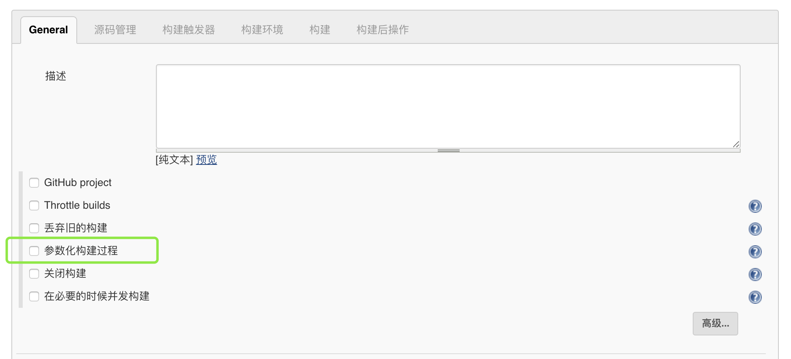

参数有上述的几种类型供选择，可以参考下图进行配置，这里不再赘述。

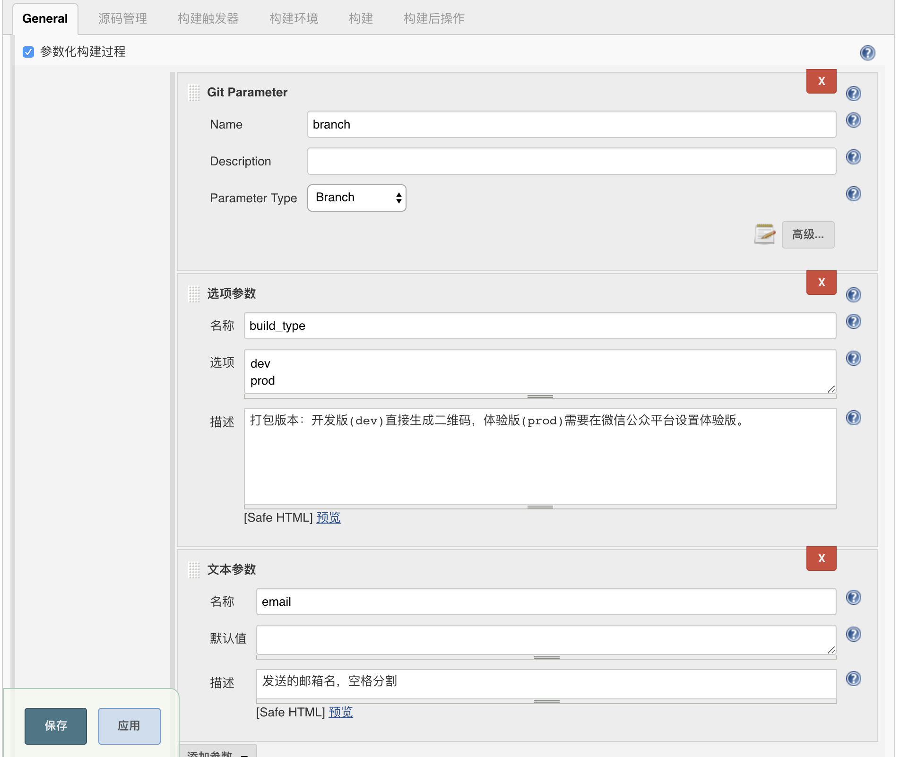

需要注意的是，这里的 name 可以通过 $name 的形式获取到，例如上面提到的 $branch 。


### 构建

在任务配置页面的 “构建” 中，选择 “执行 shell” 方式来进行构建。

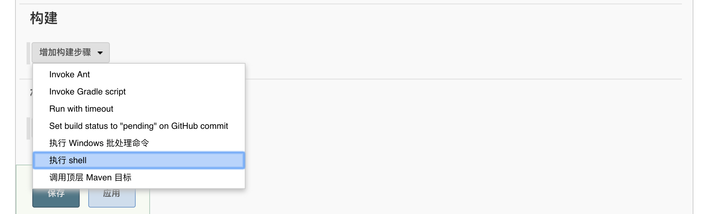

Tips：这里的 shell 脚本是微信小程序集成 Jenkins 最核心的内容。

回顾一下，本文最开始提到的微信小程序发布流程图：


这一系列的操作使用 shell 脚本来完成，如何实现呢？

#### 登录

微信开发者工具的登录需要在微信端扫码确认，这一步微信并没有提供账号密码的登录方式。不过，微信开发者工具是可以保持登录态的。由于微信限制，一个开发者身份只能在一个终端登录，所以我们申请了一个新的微信账号「前端小姐姐」用于在 Jenkins 机器上登录。

#### 项目基础设置

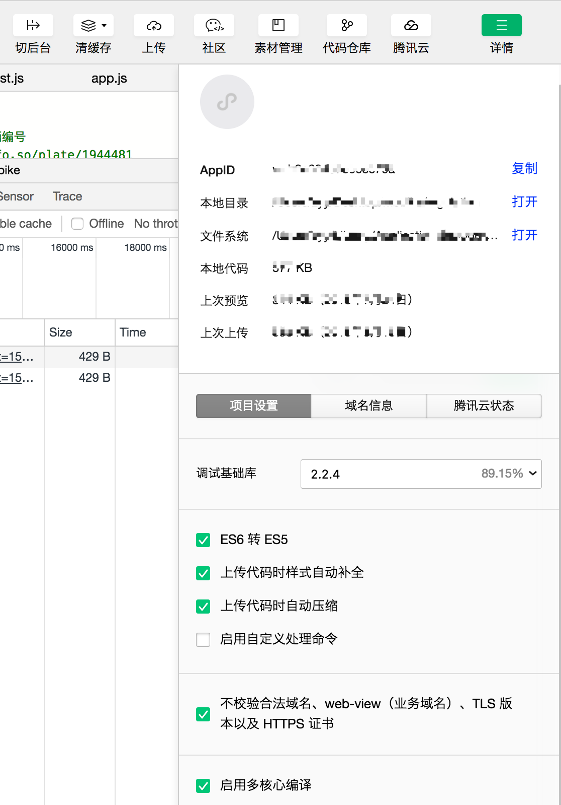

在图形化界面中，上传代码时，会在开发者工具中填入 AppID 、项目路径等信息，也会在「详情」中选择项目的基本设置，比如「ES6 转 ES5」。微信还提供了一种配置方法，在项目根目录使用 project.config.json 文件。这里通过一段 node 脚本，生成 project.config.json 文件。

```js
const fs = require('fs')

const content = '{"description":"项目配置文件。","setting":{"urlCheck":false,"es6":true,"postcss":true,"minified":true,"newFeature":true},"miniprogramRoot":"./","compileType":"miniprogram","appid":"***","projectname":"wechat-app","condition":{"search":{"current":-1,"list":[]},"conversation":{"current":-1,"list":[]},"plugin":{"current":-1,"list":[]},"game":{"currentL":-1,"list":[]},"miniprogram":{"current":-1,"list":[]}}}'

fs.writeFileSync('./dist/project.config.json', content, 'utf-8')
```

这样就完成了项目的基础设置，接下来将介绍如何通过 shell 脚本完成上传。

#### shell 脚本

```shell
echo -------------------------------------------------------
echo GIT_BRANCH: ${GIT_BRANCH}
echo -------------------------------------------------------
# 执行项目构建
npm i --registry=http://registry.npm.taobao.org
npm run build
# 打开微信开发者工具
/Applications/wechatwebdevtools.app/Contents/Resources/app.nw/bin/cli -o
port=$(cat "/Users/devops/Library/Application Support/微信web开发者工具/Default/.ide")
echo "微信开发者工具运行在${port}端口"
return_code=$(curl -sL -w %{http_code} http://127.0.0.1:${port}/open)
if [ $return_code == 200 ]
  then
  echo "返回状态码200，devtool启动成功！"
else
  echo "返回状态码${return_code}，devtool启动失败"
  exit 1
fi
if [ "$build_type" == "dev" ]
  then
  echo "发布开发版！"
  wget -O $BUILD_ID.png http://127.0.0.1:${port}/preview?projectpath=/Users/Shared/Jenkins/Home/workspace/fe-wechat-app/dist
  echo "预览成功！请扫描二维码进入开发版！"
elif [ "$build_type" == 'prod' ]
  then
  echo "准备上传！"
  /Applications/wechatwebdevtools.app/Contents/Resources/app.nw/bin/cli -u 1.0.0@/Users/Shared/Jenkins/Home/workspace/fe-wechat-app/dist --upload-desc 'initial release'
  echo "上传成功！请到微信小程序后台设置体验版并提交审核！"
fi
```

因为本项目需要编译代码，所以服务器上需要安装 node 和 npm。`npm run build` 命令不光在编译代码，而且还执行了前面介绍的生成 project.config.json 的 node 脚本。

开发版上传成功后，将二维码图片保存下来，用于构建后显示二维码和发送邮件。

这里结合**命令行调用**和 **HTTP 调用**两种方式来完成上传，主要出于以下原因：

- **HTTP 调用**可以很方便的下载生成的二维码图片
- **HTTP 服务**只有在微信开发者工具启动之后，才会启动，所以需要通过**命令行调用**方式，来启动微信开发者工具


### 构建后

使用 `description setter plugin` 插件来实现，构建完成后显示二维码图片。

#### 安装插件

回到 Jenkins 主页，在「系统管理」中，进入到「插件管理」页面，搜索 `description setter plugin` 并安装。

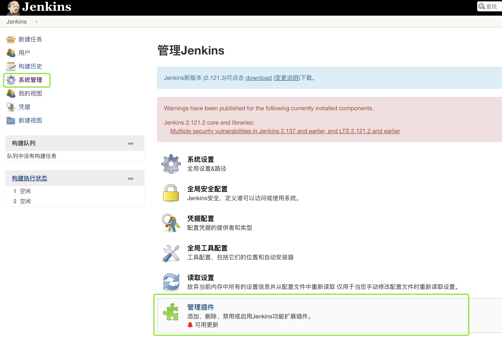

安装好插件后，返回任务配置页面。在「构建后操作」中，增加「Set build description」步骤，如下图：

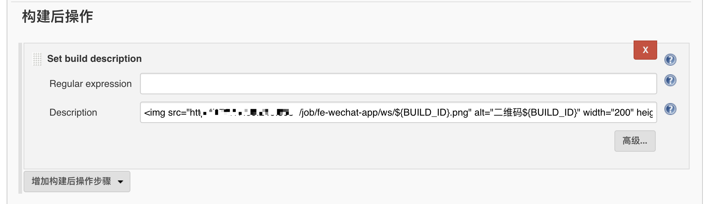

这里采用 HTML `` 标签形式，展示二维码信息，如下：

```html
 <a href="http://机器ip:端口/job/项目名称/ws/${BUILD_ID}.png">二维码${BUILD_ID}</a>
```

按照上面的方式配置后，发现图片并没有显示出来，而是显示了文本信息。这是由于 Jenkins 出于安全的限制，所有描述信息的 Markup Formatter 默认都采用 Plain text 的模式。

在「系统管理」-> 「全局安全配置」中，将 Markup Formatter 由 Plain text (纯文本) 更改为 Safe HTML 即可。

按照上面的步骤操作后，就可以显示出开发版二维码。因为 Jenkins 构建时，均使用「前端小姐姐」微信账号，所以小程序开发助手上「前端小姐姐」发布的开发版不确定是哪位同学构建的，故需要使用 Jenkins 平台生成的二维码，并注意二维码有效期（有效期25分钟）。

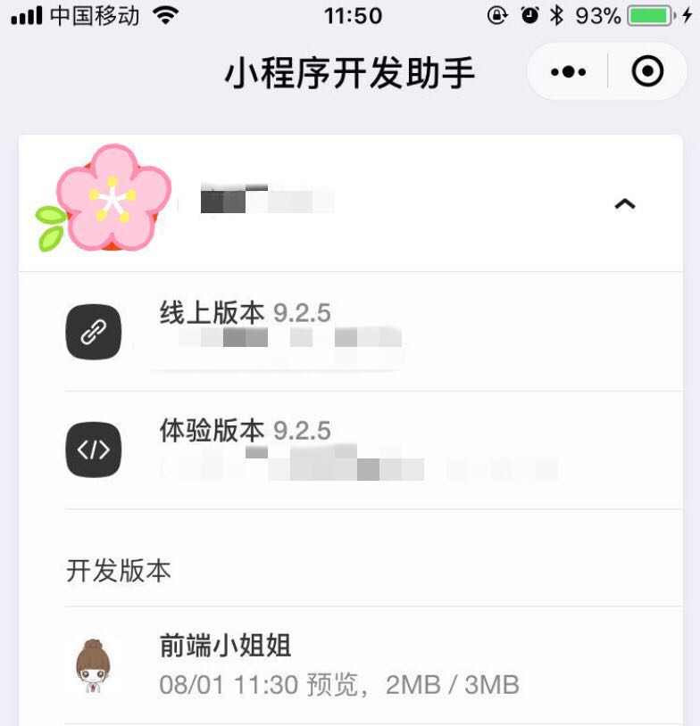

## 总结

本文以微信小程序常规的发布流程为切入点，循序渐进地介绍了如何集成 Jenkins 实现微信小程序预览、上传功能。后台、测试同事可以在该平台上选择分支获取开发版用于联调、测试，解决了本文开篇提及的问题。

由于本文篇幅有限，只是介绍了该平台的一些基本功能，如果有其他的需求，可以参考文末的拓展链接解决。此外，文中若有任何表述不清或不当的地方，欢迎大家批评指正～

拓展链接：

- [持续集成是什么？(阮一峰)](http://www.ruanyifeng.com/blog/2015/09/continuous-integration.html)  
- [Jenkins User Documentation](https://jenkins.io/doc/)
- [微信公众平台|小程序|项目配置文件](https://developers.weixin.qq.com/miniprogram/dev/devtools/projectconfig.html)
- [微信公众平台|小程序|命令行调用](https://developers.weixin.qq.com/miniprogram/dev/devtools/cli.html)
- [微信公众平台|小程序|HTTP 调用](https://developers.weixin.qq.com/miniprogram/dev/devtools/http.html)
