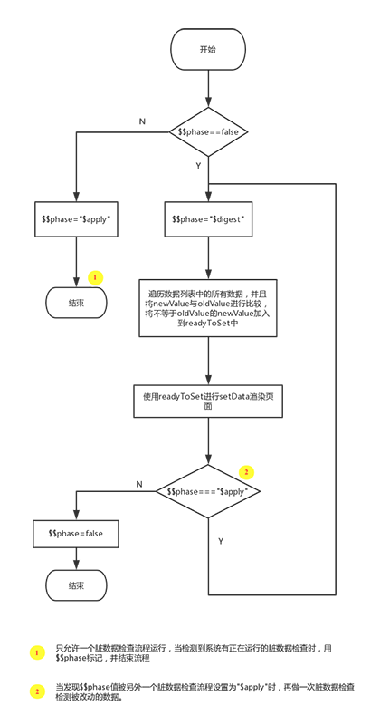

# 深入wepy源码：wepy运行原理分析

在分析源码之前，我们先来回顾一下，wepy 的使用：

```js
<!-- 小程序入口 app.wpy -->
<script>
import wepy from 'wepy';
export default class extends wepy.app {
  ......
}
</script>
```

让我们一起看看 export 出来的 class，是怎么转换成小程序语言的。

在[《深入wepy源码：wpy文件编译过程》](https://github.com/yingye/Blog/issues/3)中，我们介绍了 wepy-cli 是如何编译 wpy 文件的，里面有说到，complie-script.js 在处理 script 代码时，会加入 wepy 初始化的代码。编译之后 dist 目录下的文件，如下：

```
// dist/app.js
App(require('./npm/wepy/lib/wepy.js').default.$createApp(_default, {}));

// dist/pages/index.js 
Page(require('./../npm/wepy/lib/wepy.js').default.$createPage(Index , 'pages/index'));
```

可以看出，主要调用了 `$createApp` 和 `$createPage` 方法。在看这两个方法之前，我们先来看一下 wepy 的目录结构，以便后面的分析更好理解。

## wepy目录结构

```
├─wepy                 
  ├─src                     
    ├─app.js                全局app逻辑，请求优化、promisify API、拦截器功能等    
    ├─base.js               定义了 $createApp 和 $createPage 等方法
    ├─component.js          组件逻辑，脏值检查、组件通信等
    ├─event.js              事件方法
    ├─mixin.js              混合方法
    ├─native.js             空，代码里用于app.js中重新定义wx接口
    ├─page.js               继承component，page的一些优化
    ├─util.js               工具方法
    ├─wepy.js               入口文件
  ├─test                
  ├─...
```

## $createApp 和 $createPage

### $createApp

```js
// dist/app.js
App(require('./npm/wepy/lib/wepy.js').default.$createApp(_default, {}));
```
`$createApp()` 返回了一个类型为 object 的 config，里面包含了 `['onLaunch', 'onShow', 'onHide', 'onError']` 这些方法。

还执行了 `$initAPI()`，主要利用 `Object.defineProperty` 的 get 方法，将返回封装为 promise，这里也是 API 实现 promise 写法的核心。


### $createPage

```js
// dist/pages/index.js 
Page(require('./../npm/wepy/lib/wepy.js').default.$createPage(Index , 'pages/index'));
```
`$createPage()` 和 `$createApp()` 类似，只不过是返回的是 Page 的方法，此外，还在生命周期中，添加了数据脏值检查 `$apply()`。


## 数据绑定

wepy 使用脏数据检查对原生小程序 `setData` 进行封装，在函数运行周期结束时执行脏数据检查。如果在异步函数中更新数据时，则需要手动执行 `$apply()`。贴一张官方的流程图。



在 `$createPage()` 中，会在生命周期中调用 `$apply()`，来看一下它的定义：

```js
$apply (fn) {
  if (typeof(fn) === 'function') {
    fn.call(this);
    this.$apply();
  } else {
    if (this.$$phase) {
      this.$$phase = '$apply';
    } else {
      this.$digest();
    }
  }
}
```

`$$phase` 标识是否有 脏数据检查 在运行，如果没有，则执行 `$digest()`。

```js
$digest() {
  let k;
  let originData = this.$data;
  this.$$phase = '$digest';
  this.$$dc = 0;
  while (this.$$phase) {
    this.$$dc++;
    if (this.$$dc >= 3) {
        throw new Error('Can not call $apply in $apply process');
    }
    ......
    this.$$phase = (this.$$phase === '$apply') ? '$digest' : false;
  }
}
```
`$digest()` 执行时，主要是遍历 `originData`，将 `originData[k]` 和 `this[k]` 做对比，如果不一样，放到 `readyToSet` 中，在循环之后，统一执行 `setData` 方法。

最后，在检查 $$phase 是否有被设置为 `'$apply'`，如果是，则再做一次脏数据检查。

## 最后

本文分析的源码以 wepy@1.7.1 版本为准，更多信息可参考 [wepy github](https://github.com/Tencent/wepy/tree/1.7.x) (即 github 1.7.x 分支)。另外，文中有任何表述不清或不当的地方，欢迎大家批评指正。

