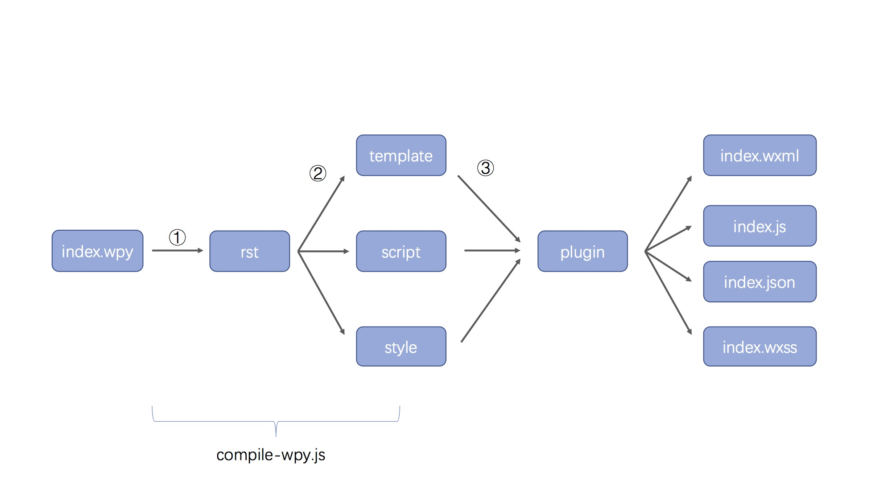
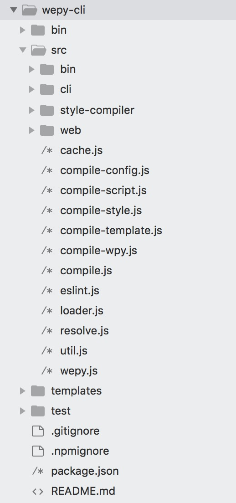
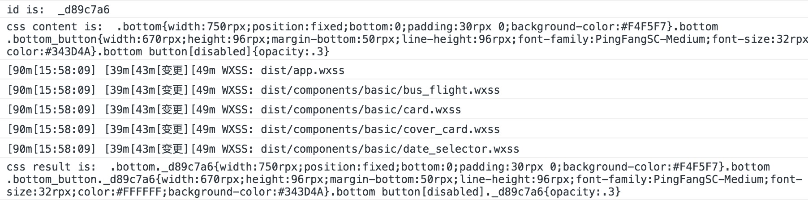

# 深入wepy源码：wpy文件编译过程


[wepy](https://github.com/Tencent/wepy) 是腾讯开源的一款小程序框架，主要通过预编译的手段，让开发者采用类 Vue 风格开发。 让我们一起看看， wepy 是如何实现预编译的。先放上一张官网的流程图，后面的分析可以参考该图。

<!--

-->


wepy-cli 主要负责 .wpy 文件的编译，目录结构如下：



编译的入口是 src/compile.js 中的 `compile()` 方法，该方法主要是根据文件类型，执行不同的 compiler ，比如 .wpy 文件会走 compile-wpy.js 下的 `compile()` 方法。

```js
compile(opath) {
  ...
  switch(opath.ext) {  
    case ext:  
      cWpy.compile(opath);  
      break;  
    case '.less':  
      cStyle.compile('less', opath);  
      break;  
    case '.sass':  
      cStyle.compile('sass', opath);  
      break;  
    case '.scss':  
      cStyle.compile('scss', opath);  
      break;  
    case '.js':  
      cScript.compile('babel', null, 'js', opath);  
      break;  
    case '.ts':  
      cScript.compile('typescript', null, 'ts', opath);  
      break;  
    default:  
      util.output('拷贝', path.join(opath.dir, opath.base)); 
    ... 
  } 
}  
```

## .wpy文件拆解

compile-wpy.js 下的 `compile()` 方法，核心调用了 `resolveWpy()` 方法。

`resolveWpy()` 方法，主要是将 .wpy 拆解成 `rst` 对象，并对其中的 template、script 做一些预处理，然后将 template、 script、 style 三部分移交给不同的 compiler 处理。

### 生成rst对象

通过 [xmldom](https://github.com/jindw/xmldom) 获取 `xml` 对象，然后遍历节点，拆解为 `rst`对象。

```js
import {DOMParser} from 'xmldom';
export default {
  createParser (opath) {
	return new DOMParser({
	  ...
	})
  },
  ...
  resolveWpy () {
    let xml = this.createParser(opath).parseFromString(content);
  }
}
```

`rst`对象结构如下：

```js
let rst = {
  moduleId: moduleId,
  style: [],
  template: {
    code: '',
    src: '',
    type: ''
  },
  script: {
    code: '',
    src: '',
    type: ''
  }
}; 
```

此外，还对 template 做了如下一些预处理：

- `pug` 预编译
- 获取文件中的 `import` ，放入 `rst.template.components` 中  
- 获取 `props` 和 `events` ，放入 `rst.script.code` 中  


### compile-template


compile-template.js 中的 `compile()` 方法，根据 template 的 lang 值，执行不同的 compiler ，比如 wepy-compile-typescript 。编译完成后，执行 compileXML 方法，做了如下的操作：

- `updateSlot` 方法: 替换 slot 内容  
- `updateBind` 方法: 在 {{}} 和 attr 上加入组件的前缀，例如：`{{width}}` -> `{{$ComponentName$width}}`
- 把自定义的标签、指令转换为 wxml 语法，例如：

```html
<repeat for="xxx" index="idx" item="xxx" key="xxx"></repeat>
<!-- 转换为 -->
<block wx:for="xxx" wx:for-index="xxx" wx:for-item="xxx" wx:key="xxxx"></block>
```

### compile-style

依旧先是根据 lang 值，先执行不同的 compiler ，比如  wepy-compile-less 。编译完成后，执行 src/style-compiler/scope.js 中的 `scopedHandler()` 方法，处理 `scoped` 。

```js
import postcss from 'postcss';
import scopeId from './scope-id';

export default function scopedHandler (id, content) {
  console.log('id is: ', id)
  console.log('css content is: ', content)
  return postcss([scopeId(id)])
    .process(content)
    .then(function (result) {
      console.log('css result is: ', result.css)
      return result.css
    }).catch((e) => {
      return Promise.reject(e)
    })
}
```
这里主要是利用 add-id 的 postcss 插件，插件源码可参考 [src/style-compiler/scope-id.js](https://github.com/Tencent/wepy/blob/2.0.x/packages/wepy-cli/src/style-compiler/scope-id.js)。根据上面的代码，打印出来的log如下：



最后，会把 `requires` 由绝对路径替换为相对路径，并在 wxss 中引入，最终生成的 wxss 文件为：

```css
@import "./../components/demo.wxss";

Page{background:#F4F5F7} ...  
```

### compile-script

依旧先是根据 lang 值，执行不同的 compiler。compiler 执行完之后，判断是否是 npm 包，如果不是，依据不同的 type 类型，加入 wepy 初始化的代码。

```js
if (type !== 'npm') {
  if (type === 'page' || type === 'app') {
    code = code.replace(/exports\.default\s*=\s*(\w+);/ig, function (m, defaultExport) {
      if (defaultExport === 'undefined') {
        return '';
      }
      if (type === 'page') {
        let pagePath = path.join(path.relative(appPath.dir, opath.dir), opath.name).replace(/\\/ig, '/');
        return `\nPage(require('wepy').default.$createPage(${defaultExport} , '${pagePath}'));\n`;
      } else {
        appPath = opath;
        let appConfig = JSON.stringify(config.appConfig || {});
        let appCode = `\nApp(require('wepy').default.$createApp(${defaultExport}, ${appConfig}));\n`;
        if (config.cliLogs) {
          appCode += 'require(\'./_wepylogs.js\')\n';
        }
        return appCode;
      }
    });
  }
}
```
接下来会执行 `resolveDeps()` 方法，主要是处理 `requires`。根据 `require` 文件的类型，拷贝至对应的目录，再把 `code` 中的 `require` 代码替换为 相对路径。

处理好的 `code` 最终会写入 `js` 文件中，文件存储路径会判断类型是否为 npm。

```js
let target;
if (type !== 'npm') {
  target = util.getDistPath(opath, 'js');
} else {
  code = this.npmHack(opath, code);
  target = path.join(npmPath, path.relative(opath.npm.modulePath, path.join(opath.dir, opath.base)));
}
```


## plugin

根据上面的流程图，可以看出所有的文件生成之前都会经过 Plugin 处理。先来看一下，compiler 中是如何载入 Plugin 的。

```js
let plg = new loader.PluginHelper(config.plugins, {
  type: 'css',
  code: allContent,
  file: target,
  output (p) {
    util.output(p.action, p.file);
  },
  done (rst) {
    util.output('写入', rst.file);
    util.writeFile(target, rst.code);
  }
});
```

其中，config.plugins 就是在 wepy.config.js 中定义的 plugins。让我们来看一下 `PluginHelper` 类是如何定义的。

```js
class PluginHelper {
  constructor (plugins, op) {
    this.applyPlugin(0, op);
    return true;
  }
  applyPlugin (index, op) {
    let plg = loadedPlugins[index];

    if (!plg) {
      op.done && op.done(op);
    } else {
      op.next = () => {
        this.applyPlugin(index + 1, op);
      };
      op.catch = () => {
        op.error && op.error(op);
      };
      if (plg)
        plg.apply(op);
    }
  }
}
```

在有多个插件的时候，不断的调用 `next()`，最后执行 `done()`。

### 编写plugin

wxss 与 css 相比，拓展了尺寸单位，即引入了 `rpx` 单位。但是设计童鞋给到的设计稿单位一般为 `px`，那现在我们就一起来编写一个可以将 `px` 转换为 `rpx` 的 wepy plugin。

从 PluginHelper 类的定义可以看出，是调用了 plugin 中的 `apply()` 方法。另外，只有 .wxss 中的 `rpx` 才需要转换，所以会加一层判断，如果不是 wxss 文件，接着执行下一个 plugin。`rpx` 转换为 `px` 的核心是，使用了 [postcss-px2units](https://github.com/yingye/postcss-px2units) plugin。下面就是设计好的 wepy-plugin-px2units，更多源码可参考 [github 地址](https://github.com/yingye/wepy-plugin-px2units)。

```js
import postcss from 'postcss';
import px2units from 'postcss-px2units';

export default class {

  constructor(c = {}) {
    const def = {
      filter: new RegExp('\.(wxss)$'),
      config: {}
    };

    this.setting = Object.assign({}, def, c);
  }
  apply (op) {

    let setting = this.setting;

    if (!setting.filter.test(op.file)) {
      op.next();
    } else {
      op.output && op.output({
        action: '变更',
        file: op.file
      });

      let prefixer = postcss([ px2units(this.setting.config) ]);

      prefixer.process(op.code, { from: op.file }).then((result) => {
        op.code = result.css;
        op.next();
      }).catch(e => {
        op.err = e;
        op.catch();
      });
    }
  }
}
```

## 最后

本文分析的源码以 wepy-cli@1.7.1 版本为准，更多信息可参考 [wepy github](https://github.com/Tencent/wepy/tree/1.7.x) (即 github 1.7.x 分支)。另外，文中有任何表述不清或不当的地方，欢迎大家批评指正。

